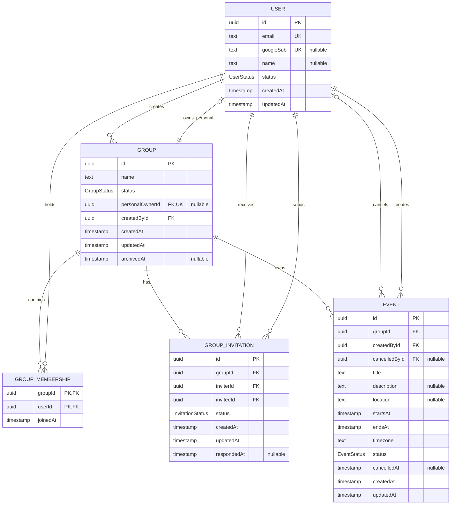

# MVP Database Design

## Purpose

This document defines the intended PostgreSQL relational model for the MVP. It is a design specification, not a Prisma schema or migration.

Events are owned only by groups. Every user has one private personal group and may also belong to many collaborative groups.

## Entity-relationship diagram

## Enumerations

### `UserStatus`

- `ACTIVE`: may authenticate and participate.
- `DISABLED`: cannot authenticate, be invited, or perform mutations. Existing records remain for referential history.

### `GroupStatus`

- `ACTIVE`: available to members and open to permitted mutations.
- `ARCHIVED`: read-only and retained for history. The MVP archives a collaborative group when its last member leaves.

### `InvitationStatus`

- `PENDING`: awaiting the invitee's response.
- `ACCEPTED`: membership was created successfully.
- `DECLINED`: invitee rejected the invitation.
- `CANCELLED`: a group member withdrew the pending invitation.

### `EventStatus`

- `SCHEDULED`: active event, whether upcoming or already past.
- `CANCELLED`: retained, visible in history, and read-only.

An event does not require a `COMPLETED` state. Past status is derived from `endsAt`.

## Entities

### `User`

The existing account record remains the source of identity. Email comparison for invitations uses the application's normalized email form. The current authentication design pre-registers users; invitations therefore target existing users only.

### `Group`

`personalOwnerId` is both an optional foreign key and a unique key:

- Non-null means the group is the user's personal group.
- Null means the group is collaborative.
- Uniqueness guarantees at most one personal group per user.
- The service-level provisioning transaction guarantees exactly one personal group and matching membership for each user.

An explicit group-type column is intentionally omitted. This avoids contradictory states such as a group marked personal without a personal owner.

`createdById` provides stable attribution even if the creator later leaves a collaborative group. `archivedAt` must be present exactly when `status` is `ARCHIVED`.

### `GroupMembership`

The composite primary key `(groupId, userId)` prevents duplicate membership. Membership has no role or permission columns; all members of a collaborative group are peers.

A personal group has exactly one membership, whose `userId` equals `personalOwnerId`. A collaborative group may have many active memberships. An archived collaborative group may have none.

### `GroupInvitation`

An invitation references existing users as both inviter and invitee. A unique constraint on `(groupId, inviteeId)` stores one current invitation record for that user and group. If the invitee is not a current member, reinviting resets an existing terminal record to `PENDING`, updates `inviterId`, and clears `respondedAt`. This includes a former member whose earlier invitation was accepted.

This deliberately models current workflow state rather than a complete invitation audit log.

### `Event`

`startsAt` and `endsAt` are UTC instants. `timezone` stores the IANA identifier used when the event was entered, such as `America/Bogota`, so clients can reproduce the intended local date and time.

The creator and cancellation actor remain attributable independently of current membership. `description` and free-text `location` are optional.

## Constraints and indexes

### Unique constraints

- `User.email`
- `User.googleSub`, when non-null
- `Group.personalOwnerId`, when non-null
- `GroupMembership(groupId, userId)`
- `GroupInvitation(groupId, inviteeId)`

### Check constraints

- `Event.endsAt > Event.startsAt`.
- A scheduled event has both `cancelledAt` and `cancelledById` null.
- A cancelled event has both `cancelledAt` and `cancelledById` non-null.
- An active group has `archivedAt` null; an archived group has it non-null.
- An invitation in `PENDING` has `respondedAt` null; every terminal invitation status has it non-null.
- An invitation cannot have the same inviter and invitee.

### Query indexes

- `GroupMembership(userId, joinedAt)` for a user's groups.
- `GroupInvitation(inviteeId, status, updatedAt)` for the invitation inbox.
- `GroupInvitation(groupId, status)` for group invitation management.
- `Event(groupId, startsAt, id)` for stable group timelines.
- `Event(groupId, status, startsAt, id)` for active and cancelled filters.

Primary and unique keys already supply indexes for direct identifier and membership checks.

## Transactional invariants

The following rules span records and must be enforced in service transactions:

1. User provisioning creates the user, personal group, and personal membership as one unit.
2. Personal groups cannot receive invitations, gain another member, be left, or be archived through normal group operations.
3. Collaborative-group creation creates the group and creator membership together.
4. Invitation acceptance changes the invitation to `ACCEPTED` and creates membership atomically. An existing membership makes the operation idempotent rather than creating a duplicate.
5. Only an active, current group member may mutate a collaborative group, manage its invitations, or mutate its scheduled events. An invitee may accept or decline only their own pending invitation.
6. Leaving removes only the caller's membership. Removing the final collaborative membership also archives the group and cancels its pending invitations in the same transaction.
7. Cancelling an event changes its status and writes the actor and timestamp atomically. No event fields can change afterward.

## Referential retention

The MVP uses status changes instead of destructive deletion for users, groups, and events. Foreign keys should therefore restrict deletion of referenced records. Membership rows may be removed when users leave because they represent current access, while attributed group, invitation, and event records remain intact.

Users who leave a collaborative group immediately lose access to its events. If the group is archived with no members, its retained data is available for operational retention but not through normal member queries.

## Deferred extensions

The model can later add RSVP records, roles, recurring event series, structured locations, invite attempts, notifications, or event revisions without changing the core rule that a group owns each event.
