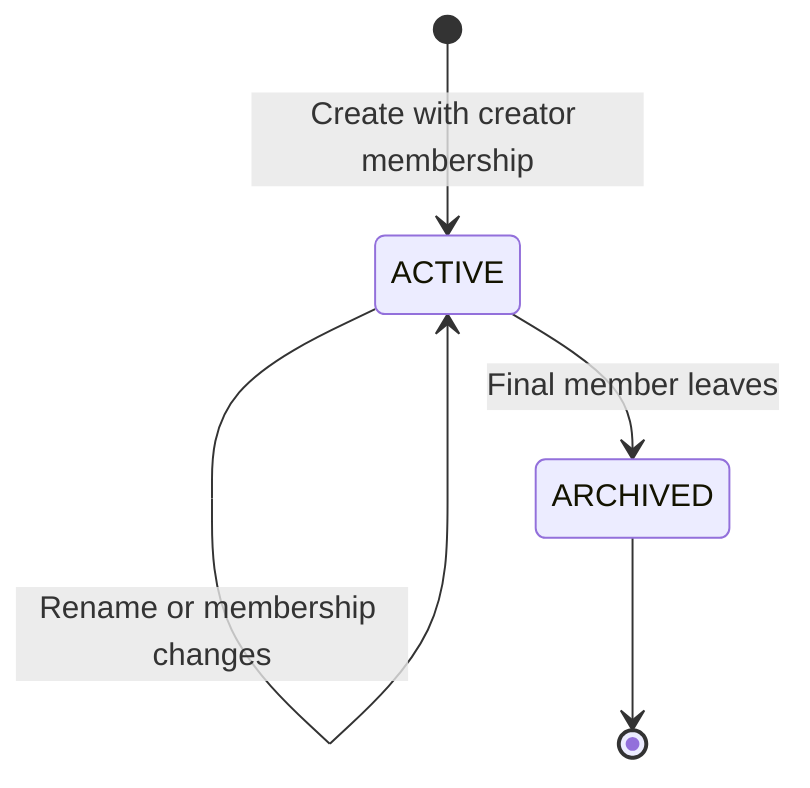

# Phase 2: Collaborative Groups

## Purpose

Allow friends, families, and couples to share private spaces with equal control. Collaborative groups are the common boundary for membership, authorization, and future events.

## User outcomes

- A user can create a private collaborative group.
- Every member can view and rename the group.
- Members have equal permissions; there is no owner or administrator role.
- A member can leave without being able to remove anyone else.

## Dependencies

- Phase 1 group and membership foundation.
- Existing authentication and active-user enforcement.

## Scope

- Collaborative-group creation and retrieval.
- Current-member listing.
- Group renaming by any member.
- Self-service departure.
- Automatic archival when the final member leaves.
- Expansion of `myGroups` to include personal and collaborative groups.

## Non-goals

- Invitations, which arrive in Phase 3.
- Removing another user.
- Roles, ownership transfer, custom permissions, or voting.
- Public group search, join requests, or invite links.
- Manual archive, unarchive, hard deletion, or membership history.
- Events, which arrive in Phase 4.

## State model

Archival is terminal in the MVP. An archived group is retained but has no members and is unavailable through normal member queries.

## Domain rules

1. A collaborative group has `personalOwnerId = null`.
2. Creation writes the group and creator membership in one transaction.
3. All current members have the same permissions.
4. Any member may rename the group. Names are trimmed, non-empty, and limited to 100 characters.
5. A member may remove only their own membership.
6. Leaving is idempotent from the caller's perspective but never removes another user.
7. If other members remain, the group stays active.
8. If the final member leaves, the same transaction archives the group and records `archivedAt`.
9. Personal groups cannot use collaborative leave or archive behavior.
10. An archived group rejects all mutations.

## Authorization

- Group details and members are visible only to current members.
- Any current member may rename an active collaborative group.
- Only the caller can initiate departure for their own membership.
- Knowing a private group ID does not grant access.
- A missing group and an inaccessible group produce the same public not-found result.

Equal permissions do not mean anonymous changes: `createdById` and normal timestamps retain basic attribution.

## Proposed GraphQL contract

### Queries

- `myGroups(first, after)`: personal and active collaborative groups for the caller, with stable cursor pagination.
- `group(id)`: one accessible group.
- `Group.members(first, after)`: current members of an accessible group.

Recommended stable ordering for `myGroups` is `updatedAt DESC, id DESC`. Cursor payloads must include both values.

### Mutations

- `createGroup(input: { name })`: creates an active collaborative group and creator membership.
- `updateGroup(input: { groupId, name })`: renames an active collaborative group.
- `leaveGroup(groupId)`: removes the caller's collaborative membership and returns a result indicating whether the group was archived.

Mutations operate through the groups domain service. Resolvers authenticate, map GraphQL inputs, and delegate.

## Validation and failure cases

- Reject blank or overlong names after trimming.
- Reject collaborative operations against a personal group.
- Reject update or leave when the caller is not a current member.
- Reject updates to archived groups.
- Treat a repeated leave as an idempotent no-membership result without exposing group details.
- Concurrent final departures must serialize safely so the group cannot remain active with zero members.

## Concurrency and transactions

- `createGroup` commits the group and creator membership together.
- `leaveGroup` removes the caller, checks remaining membership, and archives if needed within one transaction.
- Final-member detection must lock or otherwise serialize the relevant group/membership state. A count performed outside the transaction is insufficient.
- A rename racing with final departure may succeed before archival or fail after archival, but it must not mutate an already archived group.

## Acceptance criteria

1. An active user can create a collaborative group and immediately appears as its member.
2. Creation cannot leave a group without its initial membership.
3. Every current member can retrieve and rename the group.
4. Non-members cannot discover the group or member list by ID.
5. A member can leave only themselves.
6. Leaving while members remain keeps the group active.
7. The last departure archives the group atomically.
8. Archived groups reject mutations and disappear from `myGroups`.
9. Personal groups reject collaborative leave behavior.
10. Concurrent departures cannot leave an active group with no members.

## Required test scenarios

- Successful creation and rollback on membership failure.
- Name trimming and invalid-name rejection.
- Member and non-member reads and updates.
- Departure with several members.
- Final-member departure and archival.
- Concurrent departures.
- Attempts to leave a personal group.
- Attempts to mutate an archived group.
- Stable pagination when groups share the same `updatedAt`.

## Extension points

Roles can later be added to `GroupMembership` without changing group identity. Membership history would require a separate historical record or soft-ended memberships; it should not be inferred from current membership rows.
