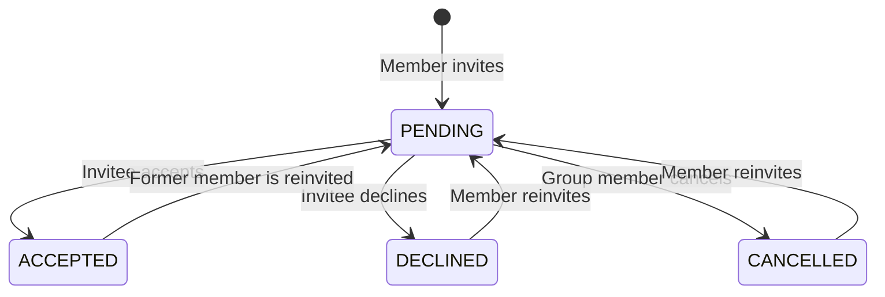

# Phase 3: Group Invitations

## Purpose

Let any member invite an existing user into a private collaborative group by exact email. Membership begins only after the invitee explicitly accepts.

## User outcomes

- Any collaborative-group member can invite a known user.
- Invitees can see pending invitations and accept or decline them.
- Accepted users become equal group members.
- Former members can be invited again.

## Dependencies

- Phase 1 user and personal-group invariants.
- Phase 2 collaborative groups, equal membership, and archival.

## Scope

- Create or resend an invitation by normalized exact email.
- Invitation inbox for the authenticated invitee.
- Pending-invitation listing for current group members.
- Accept, decline, and cancel transitions.
- Atomic membership creation on acceptance.
- Reinvitation after decline, cancellation, or a former membership.

## Non-goals

- Inviting an email that has no existing account.
- User search or autocomplete.
- Shareable links, public discovery, or join requests.
- Email, push, or in-app notifications beyond the queryable invitation inbox.
- Expiration, reminders, invitation limits, or complete attempt history.
- Member removal by another member.

## State model

Only `PENDING` may transition to a terminal state. Reinvitation is a reset of the current workflow record, not a new audit entry.

## Domain rules

1. Invitations are allowed only for active collaborative groups.
2. Any current member may invite or cancel a pending invitation.
3. The target email is trimmed and normalized using the same policy as `User.email`.
4. The target must resolve to an existing active user.
5. A user cannot invite themselves.
6. A current member cannot be invited again.
7. A group has at most one invitation record per invitee.
8. Reinviting a non-member resets any terminal record to `PENDING`, replaces `inviterId`, and clears `respondedAt`.
9. Only the invitee may accept or decline.
10. Acceptance creates ordinary membership with no role distinction.
11. Personal groups reject every invitation operation.
12. Archiving a group cancels all pending invitations in the archival transaction.

## Authorization and privacy

- Current group members may list the group's pending invitations and see invitee identity required for collaboration.
- Invitees may list and act on invitations addressed to them.
- Non-members cannot inspect a group's invitations.
- Invitation lookup is scoped to the caller's allowed relationship, not by invitation ID alone.
- A failed exact-email lookup returns a generic “user cannot be invited” result so the API does not become an account-enumeration endpoint.
- Disabled users cannot be invited or accept a previously created invitation.

## Proposed GraphQL contract

### Queries

- `myGroupInvitations(first, after)`: the caller's pending invitation inbox.
- `groupInvitations(groupId, first, after)`: pending invitations for a group accessible to the caller.

Inbox ordering is `updatedAt DESC, id DESC` with both values in the cursor.

### Mutations

- `inviteToGroup(input: { groupId, email })`: creates or resets the current invitation.
- `acceptGroupInvitation(invitationId)`: accepts and returns the newly accessible group.
- `declineGroupInvitation(invitationId)`: marks the invitation declined.
- `cancelGroupInvitation(invitationId)`: allows any current group member to cancel a pending invitation.

Invitation output includes:

- `id`
- group summary
- inviter summary
- invitee summary where authorized
- `status`
- `createdAt`
- `updatedAt`
- `respondedAt`

The API must not expose invitations in unrelated terminal states through pending-list queries.

## Validation and failure cases

- Invalid or unknown email returns the generic non-invitable result.
- Inviting a disabled user returns the same generic result.
- Self-invitation and inviting a current member are conflicts.
- Inviting into a personal or archived group is rejected.
- Acting on a non-pending invitation is idempotent only when the requested result already matches; a contradictory terminal transition is rejected.
- Acceptance fails if the group was archived or the invitee became disabled.
- A concurrent membership created through another accepted workflow must not create a duplicate.

## Transactions and concurrency

- Invitation creation or reset checks group membership, invitee eligibility, and current invitation state in one transaction.
- Acceptance locks or conditionally updates the pending invitation, creates membership, sets `ACCEPTED`, and writes `respondedAt` atomically.
- Exactly one of two concurrent acceptance attempts creates membership; the other returns the already-accepted result.
- Decline and cancellation use conditional `PENDING` updates so only one terminal transition wins.
- Final-member departure archives the group and cancels all pending invitations atomically.

## Acceptance criteria

1. Any active collaborative-group member can invite an existing active non-member by exact email.
2. No invitation reveals whether an arbitrary unknown or disabled account exists.
3. Invitees can list only their own pending invitations.
4. Group members can list only pending invitations for groups they currently belong to.
5. Only the invitee can accept or decline.
6. Acceptance creates membership and updates invitation state in one transaction.
7. All accepted members receive the same permissions as existing members.
8. Any current group member can cancel a pending invitation.
9. A declined, cancelled, or former-member invitation can be reset and sent again.
10. Personal and archived groups reject invitation operations.
11. Group archival cancels pending invitations.
12. Concurrent responses cannot create duplicate memberships or conflicting invitation states.

## Required test scenarios

- Invite an active user with case-normalized email.
- Unknown, disabled, self, and current-member targets.
- Member and non-member invitation creation.
- Personal and archived group rejection.
- Invitee inbox privacy and pagination.
- Accept, decline, cancel, and matching idempotent retry.
- Reinvite after each terminal state, including after leaving the group.
- Concurrent accept/decline and accept/cancel races.
- Group archival with pending invitations.

## Extension points

Notification delivery can subscribe to invitation state changes later. Expiration can add `expiresAt` without altering membership semantics. A full attempt history should use a separate append-only entity rather than overloading the current invitation record.
