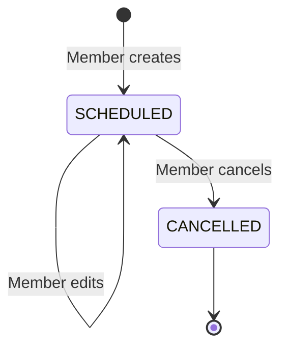

# Phase 4: Group Events

## Purpose

Allow members to coordinate one-time events inside personal or collaborative groups. Group membership is the access and participation boundary; the MVP does not track individual attendance.

## User outcomes

- A member can create an event for any active group they belong to.
- Every current group member can see and edit scheduled events.
- Any current member can cancel an event.
- Upcoming, past, and cancelled events remain available as group history.

## Dependencies

- Phase 1 personal groups and group access.
- Phase 2 collaborative groups and equal membership.
- Phase 3 is not technically required for event storage, but it completes the intended path for adding collaborative participants.

## Scope

- One-time events owned by exactly one group.
- Required title, start, end, and IANA timezone.
- Optional description and free-text location.
- Creation and cancellation attribution.
- Editing while status is `SCHEDULED`.
- Cancellation as a retained, read-only terminal state.
- Paginated upcoming and historical event queries.

## Non-goals

- RSVP, attendance, capacity, guests, or per-event participant lists.
- Recurrence or event series.
- All-day events.
- Multiple proposed dates or voting.
- Structured addresses, coordinates, or map integrations.
- Notifications, reminders, calendar sync, or conflict detection.
- Hard deletion, restoration, full revision history, or attachments.

## Ownership and participation

Every event has one `groupId`; it never belongs directly to a user. The event audience is dynamic:

- Current group members can access the event.
- A user joining a collaborative group can see its existing events.
- A user leaving immediately loses access to all group events.
- All current members are implicitly included; there is no RSVP record.

The event creator has no special permission after creation. If the creator leaves, remaining members can still edit or cancel the event.

## State model

Time does not change stored status. A past scheduled event remains `SCHEDULED`; whether it is upcoming, ongoing, or past is derived from its timestamps.

## Domain rules

1. Events can be created only in active groups by current members.
2. `title` is trimmed, non-empty, and limited to 200 characters.
3. `endsAt` must be strictly later than `startsAt`.
4. Start and end are stored as UTC instants.
5. `timezone` is a valid IANA identifier and records the event's intended display zone.
6. `description` and `location` are optional; blank values normalize to null.
7. Any current member may edit any `SCHEDULED` event.
8. Any current member may cancel any `SCHEDULED` event.
9. Cancellation atomically writes `status`, `cancelledById`, and `cancelledAt`.
10. A cancelled event is read-only and cannot be restored or deleted in the MVP.
11. Past scheduled events remain editable for factual corrections; `updatedAt` reflects the correction. Full revision history is deferred.
12. Archiving an empty collaborative group does not falsely mark its events cancelled. They remain retained under the archived group.

## Time semantics

GraphQL date-time values represent absolute instants and should include an offset or UTC marker. The service validates the separate IANA `timezone`.

Clients use the stored timezone when presenting the event's intended local time and may additionally offer a viewer-local representation. Changing start or end time requires resubmitting the intended timezone so the combination remains explicit.

Timeline classification at query time:

- `UPCOMING`: `startsAt` is in the future.
- `ONGOING`: `startsAt <= now < endsAt`.
- `PAST`: `endsAt <= now`.
- `ALL`: no time classification filter.

Cancellation status is independent of timeline classification.

## Authorization

- Only current members of an active group may create events.
- Only current members may retrieve the group's event timeline.
- Any current member may update or cancel a scheduled event.
- Non-members receive the same not-found result for absent and inaccessible events.
- Archived groups have no current members and reject event mutations.
- Creator and cancellation attribution may be shown to current members even if the attributed user later leaves.

## Proposed GraphQL contract

### Queries

- `groupEvents(groupId, timeline, statuses, first, after)`: paginated events for an accessible group.
- `event(id)`: one event when the caller currently belongs to its group.

`timeline` supports `UPCOMING`, `ONGOING`, `PAST`, and `ALL`. `statuses` supports `SCHEDULED` and `CANCELLED`.

Ordering:

- Upcoming and ongoing views: `startsAt ASC, id ASC`.
- Past and all-history views: `startsAt DESC, id DESC`.

Cursors include the ordered timestamp and ID. A cursor is valid only with the same group, timeline, status filters, and ordering that produced it.

### Mutations

- `createEvent(input: { groupId, title, description?, location?, startsAt, endsAt, timezone })`
- `updateEvent(input: { eventId, title, description?, location?, startsAt, endsAt, timezone })`
- `cancelEvent(eventId)`

Event output includes:

- `id`
- group summary
- creator summary
- optional cancellation actor summary
- title, description, and location
- start, end, and timezone
- status and cancellation timestamp
- creation and update timestamps

There is no delete or restore mutation.

## Validation and failure cases

- Reject blank or overlong titles.
- Reject an end that is equal to or before the start.
- Reject unknown or malformed IANA timezones.
- Reject creation in personal or collaborative groups the caller cannot access.
- Reject updates and cancellation for inaccessible or archived-group events.
- Reject updates to a cancelled event.
- Repeating cancellation of an already cancelled event returns the current cancelled representation without changing attribution.
- Normalize optional blank description and location values consistently.

## Transactions and concurrency

- Creation checks active membership and writes the event in one transaction boundary.
- Update conditionally targets a `SCHEDULED` event and verifies membership in the same operation or transaction.
- Cancellation conditionally changes only `SCHEDULED` to `CANCELLED` and writes both cancellation fields together.
- Concurrent update and cancellation may have only one valid final ordering: an update committed before cancellation is retained; an update after cancellation is rejected.
- Concurrent cancellation retries must preserve the actor and timestamp from the first successful cancellation.

## Acceptance criteria

1. A current member can create an event in a personal or active collaborative group.
2. A non-member cannot discover, create, update, or cancel a group event.
3. Every current member has equal edit and cancellation permissions.
4. Event end must be later than start, and timezone must be a valid IANA identifier.
5. Joining grants access to existing group events; leaving removes that access.
6. Updating a scheduled event retains its creator and changes `updatedAt`.
7. Cancelling records the first successful actor and timestamp atomically.
8. Cancelled events are retained, queryable, and read-only.
9. Past events remain queryable through stable cursor pagination.
10. Group archival retains events without changing them to cancelled.
11. Concurrent mutation races cannot modify an event after cancellation.

## Required test scenarios

- Creation in personal and collaborative groups.
- Member and non-member authorization for every operation.
- Required fields, whitespace normalization, time ordering, and timezone validation.
- Update by a member other than the creator.
- Creator departure followed by update or cancellation by a remaining member.
- Cancellation, idempotent retry, and cancelled-event update rejection.
- Concurrent update/cancel and cancel/cancel races.
- Upcoming, ongoing, past, cancelled, and combined timeline filters.
- Stable pagination where events share the same start time.
- Event retention after final-member group archival.

## Extension points

RSVP can later add an `EventResponse` relation without changing event ownership. Recurrence should introduce a series entity and occurrence strategy rather than overloading this one-time event. Revision history can be append-only while the current `Event` remains the query projection.
